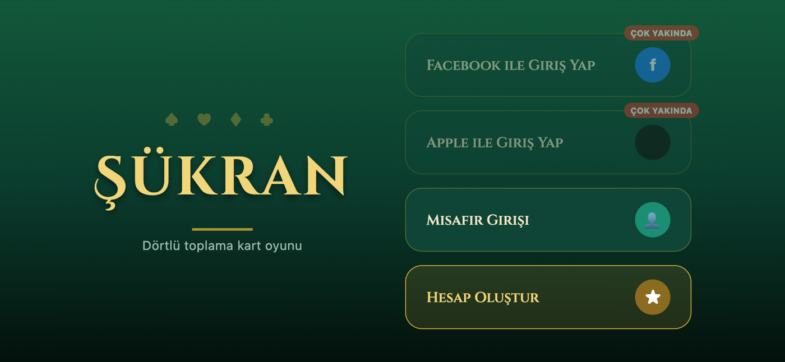
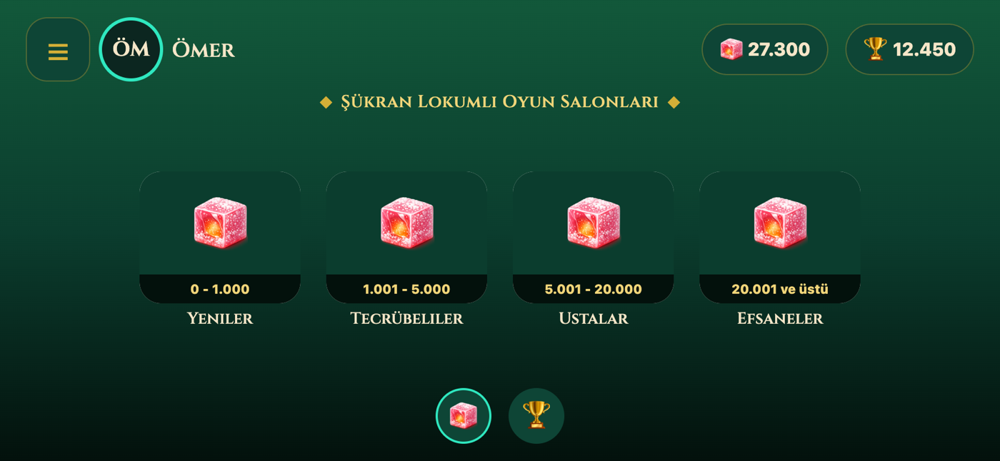
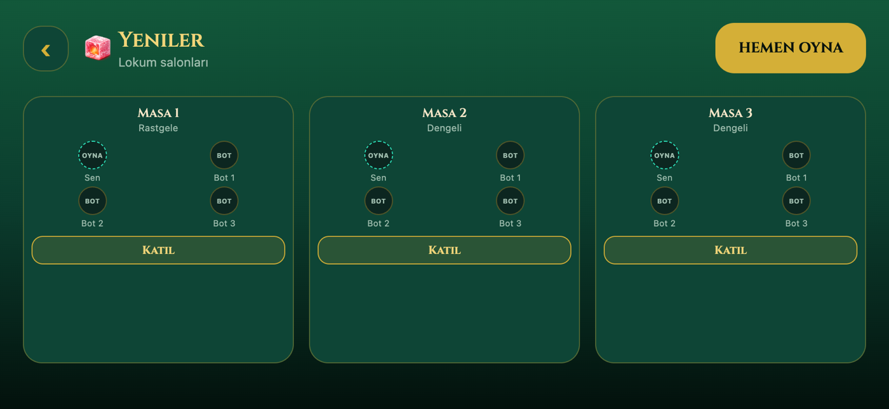
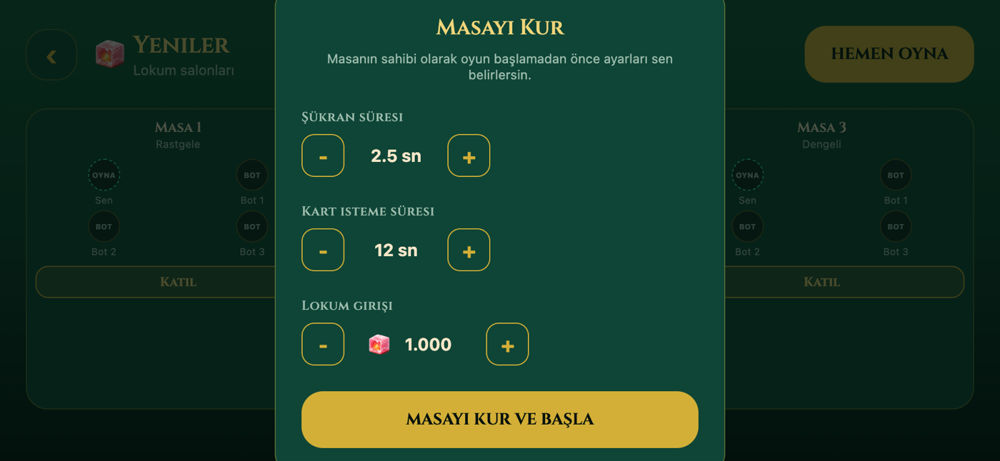
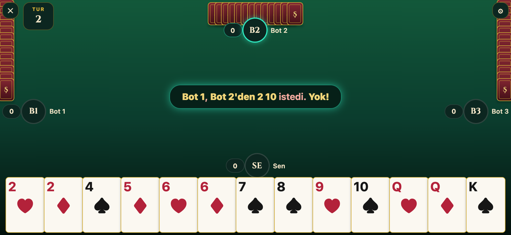
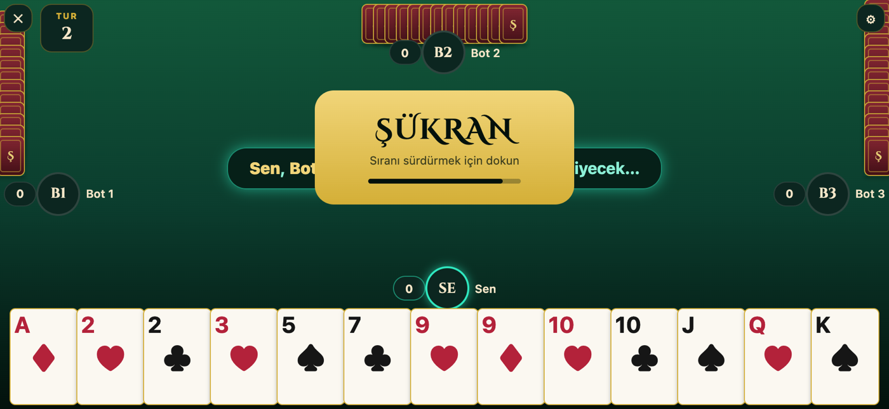
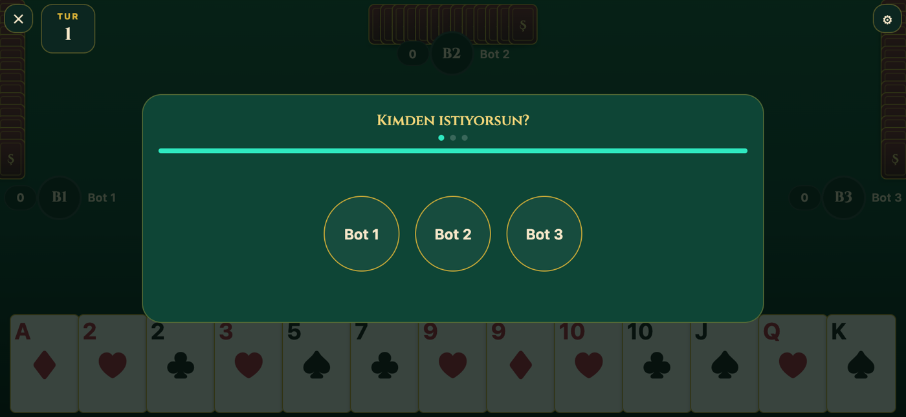
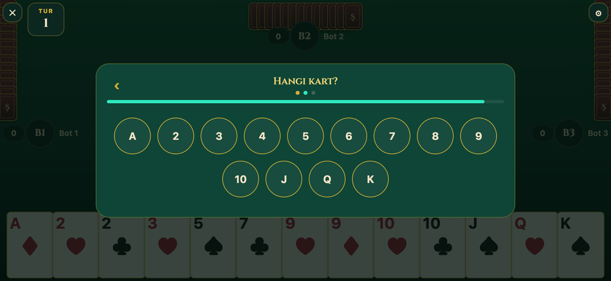
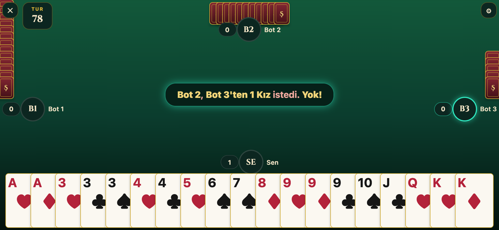

<p align="center">
  
</p>

<h1 align="center">Şükran — Mobil Kart Oyunu</h1>

<p align="center">
  <a href="README.md">English</a> · <b>Türkçe</b>
</p>

<p align="center">
  
  
  
  
  
</p>

Geleneksel Türk kart oyunu **Şükran**'ın **React Native (Expo)** ve **TypeScript** ile geliştirilmiş mobil versiyonu. Masadaki dört oyuncu birbirinden kart ister, aynı değerden dörtlüler toplamaya çalışır ve sırasını korumak için zamanında *"Şükran!"* demeyi unutmamalıdır. Farklı zorluk seviyelerindeki üç bota karşı, kendi bahis, süre ve para birimi olan kademeli odalarda oynarsınız.

---

## Ekran görüntüleri

| Giriş | Lobi | Odalar |
|---|---|---|
|  |  |  |

| Masa kurulumu | Oyun masası | Şükran! |
|---|---|---|
|  |  |  |

| İstek: kimden? | İstek: hangi kart? | Oyun ilerledikçe |
|---|---|---|
|  |  |  |

> Ekran görüntüleri web sürümünden, yerel bir demo profiliyle alındı (canlı Firebase bağlantısı olmadan).

## Oyun nasıl oynanır?

| | |
|---|---|
| **Kurulum** | 4 oyuncu (sen + 3 bot), 52 kartlık deste, her oyuncuya 13 kart. |
| **Amaç** | Aynı değere sahip 4 kartı toplamak (örn. 4 Papaz). |
| **Kart isteme** | Sıra sendeyken bir rakip, bir kart değeri ve adet (1–3) seçip *Kart İste* dersin. O karttan kendi elinde olması şart değildir. |
| **Kart verme** | Rakipte o karttan istediğin sayı kadar ya da daha fazla varsa tam istediğin sayıda kart sana verilir. Yoksa hiç kart verilmez, rakip yalnızca *"Yok"* der. |
| **Şükran** | Başarılı istekten sonra **ŞÜKRAN** butonu belirir. Süre dolmadan basarsan sıra sende kalır. Basmazsan sıra kartları veren oyuncuya geçer. |
| **Sıra geçişi** | *"Yok"* cevabı gelirse sıra doğrudan istek yapılan oyuncuya geçer. |
| **Dörtlüler** | Aynı değerden 4 kart elden otomatik çıkar ve tamamlanmış set sayılır. |
| **Bitiş** | 13 değerin tamamı tamamlanınca en çok dörtlü toplayan kazanır. Beraberlik olabilir. |

## Özellikler

- **Eksiksiz oyun motoru.** Deste, dağıtım, kart isteme, Şükran aşaması, dörtlü tamamlama, oyun sonu ve sıralama [`src/game/`](src/game) altında saf TypeScript modülleri olarak yazıldı.
- **3 zorluk seviyeli bot yapay zekası.** Botlar son başarılı istekleri hatırlar, elinde olan kartlara öncelik verir ve bazen Şükran demeyi "unutur" (kolay / normal / zor için %30 / %15 / %6).
- **İki para birimi, kademeli odalar.**
  - **Lokum** odaları: *Yeniler → Tecrübeliler → Ustalar → Efsaneler*. Üst odalarda botlar zorlaşır, Şükran süresi kısalır (2,5 sn → 1 sn) ve bahis büyür (1.000 → 50.000).
  - **Puan** odaları: sabit giriş ücretli 3 kademe.
  - Oyuncu hiç takılı kalmasın diye günlük ücretsiz lokum takviyesi.
- **Ödül havuzu.** Birinci potun büyük kısmını alır, ikinci bahsini geri alır. Berabere kalan oyuncular denk geldikleri sıraların ödüllerini eşit paylaşır ([`payout.ts`](src/game/payout.ts)).
- **Masa ayarları.** Masayı kuran oyuncu, oyun başlamadan Şükran ve istek sürelerini belirli sınırlar içinde değiştirebilir.
- **Hesaplar ve arkadaşlar (Firebase).** Misafir girişi ya da benzersiz kullanıcı adlı gerçek hesap. Oyuncu arama, arkadaşlık isteği gönderme, kabul etme ve reddetme. Misafirler aramada görünmez. Erişim [`firestore.rules`](firestore.rules) ile korunur.
- **İstatistikler.** Oynanan oyun, galibiyet, galibiyet oranı, toplam dörtlü, başarılı/başarısız istek, unutulan Şükran, en iyi skor.
- **Detaylar.** Kart dağıtma animasyonu (Reanimated), her oyun olayı için ses efekti, titreşim, istek süresinin sonunda "acele et" tık sesi, Cinzel fontları ve altın detaylarla yatay kart masası arayüzü.

## Teknolojiler

- [Expo](https://expo.dev) SDK 54 · React Native 0.81 · React 19
- **Expo Router** (dosya tabanlı yönlendirme, typed routes)
- **TypeScript**
- Oyun, profil, arkadaş ve ayar durumu için **Zustand**
- **Firebase**: Anonymous Auth + Firestore (AsyncStorage ile oturum kalıcılığı)
- `react-native-reanimated`, `expo-linear-gradient`, `expo-audio`, `expo-haptics`
- ESLint (`eslint-config-expo`) + Prettier

## Proje yapısı

```
├── app/                    # Ekranlar (Expo Router)
│   ├── login.tsx           # Misafir / hesap girişi
│   ├── lobby.tsx           # Para birimi + oda kademesi seçimi
│   ├── rooms.tsx           # Kademedeki masalar, masa ayarları
│   ├── game.tsx            # Kart masası
│   ├── result.tsx          # Sıralama ve ödüller
│   ├── friends.tsx         # Arama, istekler, arkadaş listesi
│   ├── statistics.tsx
│   └── rules.tsx
├── src/
│   ├── game/               # Saf oyun mantığı: deste, kurallar, sıra, istek, setler, bot-ai, ödül
│   ├── store/              # Zustand store'ları (game, profile, friends, settings)
│   ├── components/         # Kartlar, eller, koltuklar, banner'lar, paneller
│   ├── constants/          # Kartlar, süreler, kademeler, tema
│   ├── config/firebase.ts
│   └── utils/              # Ses, depolama, rastgelelik, biçimlendirme
├── assets/                 # İkonlar, lokum görseli, ses efektleri
├── firestore.rules         # Firestore güvenlik kuralları
└── FIREBASE_SETUP.md       # Adım adım Firebase kurulumu
```

## Kurulum

```bash
git clone https://github.com/OmerP14/Sukran-MobileGame.git
cd Sukran-MobileGame
npm install
npm start          # ardından Android için a, iOS için i; ya da Expo Go ile QR'ı okutun
```

### Firebase (hesaplar ve arkadaşlar için)

Proje kökünde bir `.env.local` dosyası oluşturun:

```
EXPO_PUBLIC_FIREBASE_API_KEY=
EXPO_PUBLIC_FIREBASE_AUTH_DOMAIN=
EXPO_PUBLIC_FIREBASE_PROJECT_ID=
EXPO_PUBLIC_FIREBASE_STORAGE_BUCKET=
EXPO_PUBLIC_FIREBASE_MESSAGING_SENDER_ID=
EXPO_PUBLIC_FIREBASE_APP_ID=
```

**Anonymous Authentication**'ı açın, bir **Firestore** veritabanı oluşturun ve [`firestore.rules`](firestore.rules) içeriğini yapıştırın. Ayrıntılı anlatım [`FIREBASE_SETUP.md`](FIREBASE_SETUP.md) dosyasında.

> Firebase ayarları yoksa uygulama bir uyarı yazar ve hesap/arkadaş özellikleri çalışmaz.

## Komutlar

```bash
npm start          # Expo geliştirme sunucusu
npm run android    # Android'de aç
npm run ios        # iOS'ta aç
npm run typecheck  # tsc --noEmit
npm run lint       # ESLint
npm run format     # Prettier
```

## Sınırlamalar

- Oyunlar **botlara karşı** oynanır. Hesaplar ve arkadaşlar çevrim içi, ancak masada henüz gerçek zamanlı çok oyunculu mod yok.
- Oyun içi arayüz yalnızca Türkçe.
- Henüz otomatik test yok.

## Lisans

Henüz lisans dosyası yok, bu yüzden varsayılan olarak tüm hakları saklıdır. Kodu kullanmak isterseniz bir issue açabilirsiniz.
